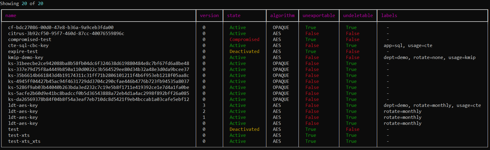
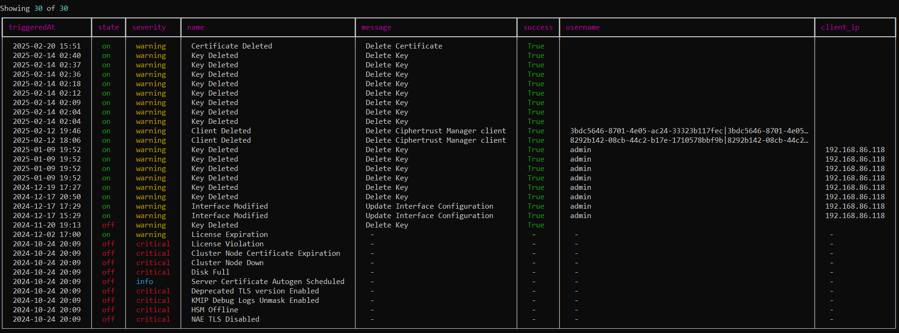
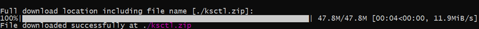
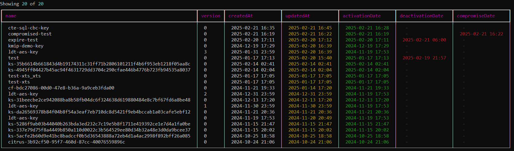
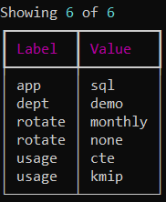
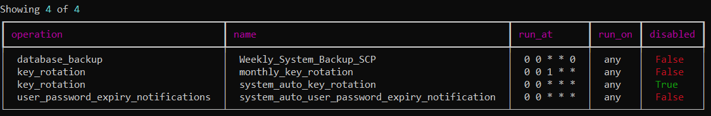
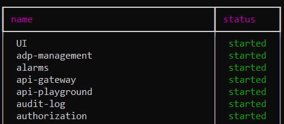
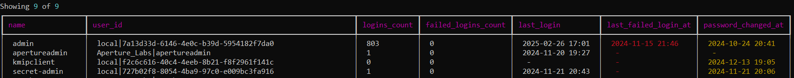

# CMInfo

CMINFO is a Python utility that presents CipherTrust information in an easy to visualize format. 

Traditionally, the standard **ksctl** CLI tool returns all results as JSON structured output. This requires parsing the JSON with various methods to present information in a consumable format.

For example, to output a sorted list of keys with interesting fields, you could do the following in a bash shell:
```bash
ksctl keys list | jq -r '[.resources[] | {name: .name, algorithm: .algorithm, state: .state}] | sort_by(.name) | .[] | "\(.name), \(.algorithm), \(.state)"'
```

With _cminfo_, the same results are displayed with:
```bash
cminfo.py key list
```


## Contents
- [Installation](#installation)
- [Authentication](#authentication)
- [Usage](#usage)
    - [Alarm](#alarm)
    - [Download](#download)
    - [Key](#key)
    - [User](#user)
    - [Schedule](#schedule)
    - [Service](#service)
    - [System](#system)
- [Roadmap](#roadmap)


## Installation

### Prerequisites
- Python 3.6+
- Required Python libraries:
  - `click`
  - `json`
  - `requests`
  - `urllib3`
  - `datetime`
  - `python-dotenv`
  - `rich`
  - `tqdm`

### Install Dependencies
You can install the required libraries using pip:
```bash
pip install -r requirements.txt
```

It is recommended to create a separate environment first using **venv** or **conda**.

## Generate Binary
Compiled binaries can be generated using PyInstaller or cx_Freeze.
For example, using PyInstaller:
```bash
pyinstaller -i .\images\logo.ico --onefile .\cminfo.py
```


## Authentication
**cminfo** can use parameters, .env file, or environment variables for authentication into CipherTrust.

### Option 1: No environment and no parameters

Run without any authentication information in the environment or passed on the CLI, cminfo will prompt for appropriate values.

### Option 2: CLI parameters

If run with CLI parameters, cminfo will override any defaults or values received from the environment.

```bash
Usage: cminfo.py [OPTIONS] COMMAND [ARGS]...

Options:
  -h, --host TEXT        CipherTrust node FQDN or IP
  -u, --username TEXT    Username
  -p, --password TEXT    Password
  -d, --domain TEXT      Domain
  -a, --authdomain TEXT  Authentication domain
  --debug
  --version              Show the version and exit.
  --help                 Show this message and exit.
```

For example, the command:

``` bash
python .\cminfo-v1.3.py -h cm1.aperture.lab -u admin -d root -a root key list
```

This prompts only for the password since the other values were provided as parameters.

### Option 3: Environment variables

cminfo will check for a **.env** file in the same directory. This file may provide defaults to the following:

``` bash
CM_HOST=
CM_USER=
CM_PW=
CM_DOMAIN=root
CM_AUTHDOMAIN=root
CM_LIMIT=100
```

The same values can also be pulled from the shell environment if no .env file is present.

## Usage

### Alarm
#### Alarm List
To list alarms, use the following command:
```bash
Usage: cminfo-v1.3.py alarm list [OPTIONS]

Options:
  -l, --limit TEXT                Maximum number of objects to show
  --state [on|off]
  --severity [info|warning|error|critical]
  --help                          Show this message and exit.

```


### Download
#### Download KSCTL
This is a convenience function to download the ksctl tool package from the CipherTrust Manager.

**NOTE:** **cminfo** does not required ksctl to function.

```bash
Usage: cminfo-v1.3.py download ksctl [OPTIONS]

Options:
  -h, --host TEXT  Download from this CipherTrust node
  -p, --path TEXT  Download file to this directory
  --help           Show this message and exit.
```


### Key
#### Key Dates
To list key dates, use the following command:
```bash
Usage: cminfo-v1.3.py key dates [OPTIONS]

Options:
  -l, --limit TEXT                Maximum number of objects to show
  -s, --state [Pre-Active|Active|Deactivated|Destroyed|Compromised|Destroyed Compromised]
  -t, --type [AES|RSA|EC|OPAQUE]
  --help                          Show this message and exit.

```


#### Key Labels
Display all key labels currently applied to keys.
```bash
Usage: cminfo-v1.3.py key labels [OPTIONS]

Options:
  -l, --limit TEXT  Maximum number of objects to show
  --help            Show this message and exit.
```


#### Key List

List all keys. Supports filtering by algorithm and state. Sorting is supported by column name.
```bash
Usage: cminfo-v1.3.py key list [OPTIONS]

Options:
  -l, --limit TEXT                Maximum number of objects to show
  -s, --state [Pre-Active|Active|Deactivated|Destroyed|Compromised|Destroyed Compromised]
  -a, --type [AES|RSA|EC|OPAQUE]
  --sort [name|version|state|algorithm|exportable|deletable]
  --help                          Show this message and exit.
```


### Schedule
#### Schedule List

Show all schedule configurations.
```bash
Usage: cminfo-v1.3.py schedule list [OPTIONS]

Options:
  -l, --limit TEXT                Maximum number of objects to show
  --sort [name|version|state|algorithm|exportable|deletable]
```


### Service
#### Service List

Show the state of all CipherTrust microservices.
```bash
Usage: cminfo-v1.3.py service list [OPTIONS]

Options:
  --help                          Show this message and exit.
```


### User
#### User Logins

Show login information for each user.
```bash
Usage: cminfo-v1.3.py user logins [OPTIONS]

Options:
  -l, --limit TEXT  Maximum number of objects to show
  --help            Show this message and exit.
```


## Roadmap:
[Feature Requests and Enhancements](https://github.com/thalescpl-io/ciphertrust-info/issues?q=is%3Aissue%20state%3Aopen%20type%3AFeature)